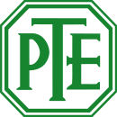
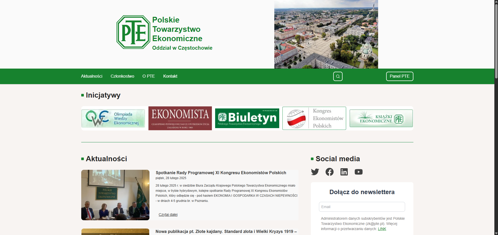
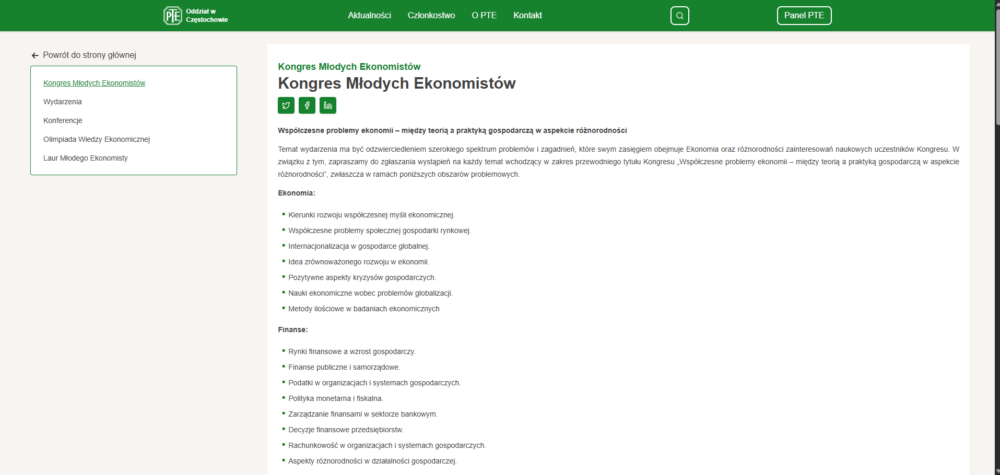
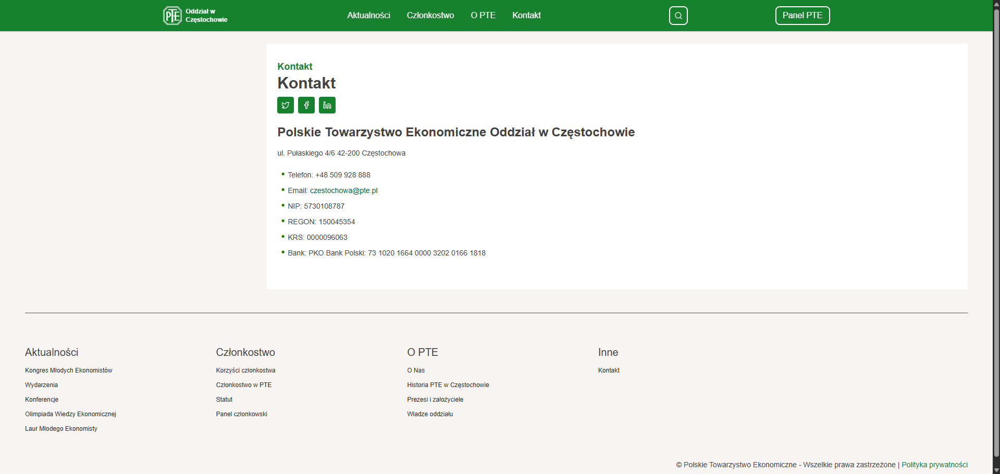
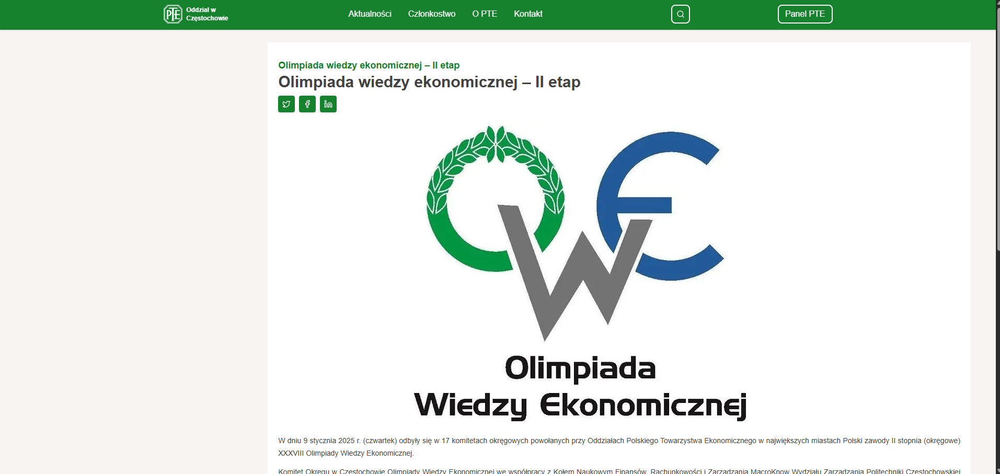

<p align="center">
  
</p>
<h1 align="center">Polskie Towarzystwo Ekonomiczne Oddział w Częstochowie</h1>

- czestochowapte.pl to szkolny projekt — aplikacja webowa inspirowana oficjalną stroną Zarządu Krajowego Polskiego Towarzystwa Ekonomicznego (pte.pl). Projekt został stworzony z myślą o nowoczesnej prezentacji treści.
- Aplikacja została zaprojektowana i zbudowana przy użyciu nowoczesnego stosu technologicznego: Next.js, TypeScript oraz Tailwind CSS, co zapewnia szybkie ładowanie stron, wysoką wydajność, pełną responsywność na wszystkich urządzeniach.
- Kluczowym elementem architektury projektu jest integracja z Headless CMS – Strapi, z którym aplikacja komunikuje się za pomocą GraphQL API. Dzięki temu rozwiązaniu zarządzanie treściami odbywa się dynamicznie, bez konieczności ingerowania w kod źródłowy, umożliwiając łatwą edycję i publikację materiałów w czasie rzeczywistym.
  
--- 

<h2>Stack Technologiczny 🧰</h2>

| Stack | Opis                                                                                                         |
| --------- | ------------------------------------------------------------------------------------------------------------------- |    
| [TypeScript](https://www.typescriptlang.org/) | Język programowania oparty na JavaScript, oferujący statyczną kontrolę typów. 
| [Next.js](https://nextjs.org/) | Struktura React dla produkcji 
| [React](https://reactjs.org/) | Biblioteka do tworzenia interfejsów użytkownika 
| [Tailwind CSS](https://tailwindcss.com/)               | Biblioteka CSS oparta na klasach użytkowych                     
| [Shadcn](https://ui.shadcn.com/)                  | Dostępne i składane komponenty interfejsu użytkownika bez interfejsu użytkownika 
| [Github Actions](https://github.com/features/actions)  | Automatyzacje usprawniające procesy pracy                     
| [ESLint](https://eslint.org/)                          | Lintowanie TypeScriptu                                    
| [Prettier](https://prettier.io/)                       | Formater kodu
| [Strapi](https://strapi.io/)                       | Headless CMS do szybkiego tworzenia API
| [GraphQL](https://graphql.org/learn/)                       | Wydajny język zapytań do API

--- 

<div align="center">




</div>

--- 

<h2 align="center">Twórcy 💼</h2>


<p align="center">
  To właśnie my przyczyniliśmy się do rozwoju oraz tworzenia tego projektu.<br/>
  Wsparliśmy go także, zostawiając gwiazdki i dodając motywacji do dalszych działań.

</p>


<p align="center">
  <a href="https://github.com/Kubaleek">
    
  </a>
  &nbsp;&nbsp;

  <a href="https://github.com/danyPL">
    
  </a>

</p>

--- 

<h2>Jak zacząć 🚀</h2>

```bash
git clone https://github.com/Kubaleek/czestochowapte.pl.git
npm install
npm run dev

```

--- 

