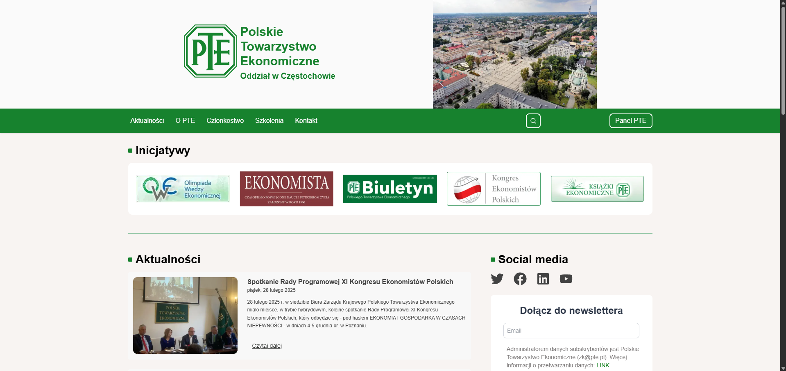
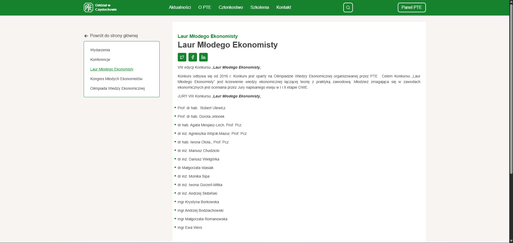
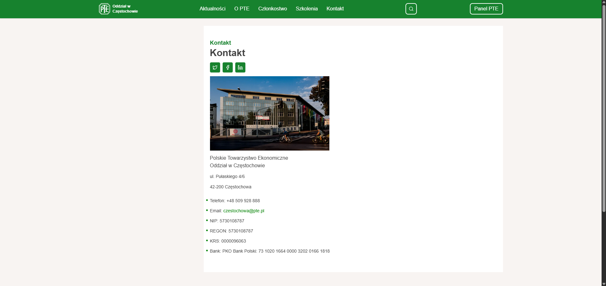

## Widok Projektu

|  |  |  |
|-----------|-----------|-----------|
|  |  |  |

## Polskie Towarzystwo Ekonomiczne - Oddział w Częstochowie

czestochowapte.pl to szkolny projekt - aplikacja webowa oparta głównie na wyglądzie strony zarządu krajowego pte.pl. Została stworzona przy użyciu Next.js, TypeScript, Tailwind CSS, GraphQL oraz ShadCN. Aplikacja jest w pełni zintegrowana z CMS WordPress, co umożliwia dynamiczne zarządzanie treściami, w tym nawigacją, stopką oraz stronami.

## 🛠️ Technologia

| Kategoria | Technologie                                                                                                         |
| --------- | ------------------------------------------------------------------------------------------------------------------- |
| Frontend  | [TypeScript](https://www.typescriptlang.org/), [Tailwind](https://tailwindcss.com/), [Next.js](https://nextjs.org/), [Shadcn](https://ui.shadcn.com) |
| Backend   | [WordPress](https://wordpress.org/), [GraphQL](https://graphql.org/)                                                |
| Inne      | [Git](https://git-scm.com/book/pl/v2/Pierwsze-kroki-Podstawy-Git)                                                                                                          |

## 🌐 Autorzy

<table>
  <tr>
    <td align="center"><a href="https://github.com/Kubaleek"> <b>Kuba 'Kubaleek' Król</b></a> </td>
    <td align="center"><a href="https://github.com/danyPL"> <b>Daniel 'danyPL' Siwiec</b></a> </td>
  </tr>
</table>
